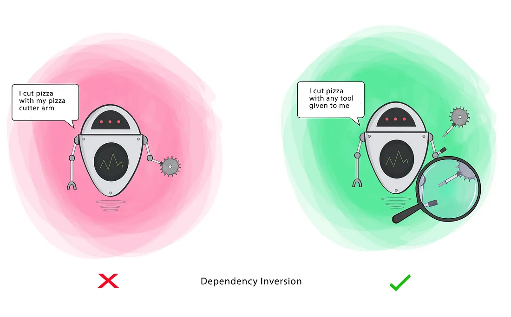

# Dependency Inversion

- Class should depend on interfaces rather than concrete classes
- High-level modules should not depend on low-level modules. Both should depend on the abstraction.
- Abstractions should not depend on details. Details should depend on abstractions.

**Additionally:**
1. Abstractions should not depend on details. Details should depend on abstractions.

**Goal:** This principle aims at reducing the dependency of a high-level Class on the low-level Class by introducing an interface.

**Key Ideas:**
1. High-level modules (e.g., business logic) should not depend directly on low-level modules (e.g., database or file systems).
2. Instead, both should depend on an abstraction (e.g., an interface or abstract class).
3. This abstraction decouples the modules, making it easier to change or replace the implementation without affecting other parts of the code.



**Without DIP**
```c++
#include <iostream>
#include <string>

// Low-level module
class EmailService {
public:
    void sendEmail(const std::string& message) {
        std::cout << "Sending email: " << message << "\n";
    }
};

// High-level module
class OrderProcessor {
private:
    EmailService emailService;  // Direct dependency

public:
    void processOrder(const std::string& order) {
        std::cout << "Processing order: " << order << "\n";
        emailService.sendEmail("Your order has been processed!");
    }
};

int main() {
    OrderProcessor orderProcessor;
    orderProcessor.processOrder("Order #123");
    return 0;
}
```

**Issues:**
1. `OrderProcessor` is tightly coupled with `EmailService`. If we want to change how emails are sent (e.g., using SMS instead), we have to modify the `OrderProcessor`.
2. Adding new communication methods would require changing the high-level module.


**With DIP:**
To follow the Dependency Inversion Principle, we introduce an abstraction for the `EmailService`, such as an `ICommunicationService` interface, which both the high-level `OrderProcessor` and the low-`level` EmailService will depend on

```C++
#include <iostream>
#include <string>
#include <memory>

// Abstraction for communication services
class ICommunicationService {
public:
    virtual void sendMessage(const std::string& message) = 0;
    virtual ~ICommunicationService() = default;
};

// Low-level module: EmailService
class EmailService : public ICommunicationService {
public:
    void sendMessage(const std::string& message) override {
        std::cout << "Sending email: " << message << "\n";
    }
};

// Low-level module: SMSService
class SMSService : public ICommunicationService {
public:
    void sendMessage(const std::string& message) override {
        std::cout << "Sending SMS: " << message << "\n";
    }
};

// High-level module: OrderProcessor
class OrderProcessor {
private:
    std::shared_ptr<ICommunicationService> communicationService;  // Depend on abstraction

public:
    OrderProcessor(std::shared_ptr<ICommunicationService> service) : communicationService(service) {}

    void processOrder(const std::string& order) {
        std::cout << "Processing order: " << order << "\n";
        communicationService->sendMessage("Your order has been processed!");
    }
};

int main() {
    // Use EmailService
    std::shared_ptr<ICommunicationService> emailService = std::make_shared<EmailService>();
    OrderProcessor emailOrderProcessor(emailService);
    emailOrderProcessor.processOrder("Order #123");

    // Use SMSService
    std::shared_ptr<ICommunicationService> smsService = std::make_shared<SMSService>();
    OrderProcessor smsOrderProcessor(smsService);
    smsOrderProcessor.processOrder("Order #456");

    return 0;
}
```

**Benefits of DIP:**
1. Decoupling: `OrderProcessor` no longer depends on a concrete `EmailService`. Instead, it depends on the abstraction `ICommunicationService`.
2. Extensibility: Adding a new communication method (e.g., `SMSService`) doesn’t require modifying the Ord`erProcessor. We simply create a new class implementing `ICommunicationService`.
3. Maintainability: Changes in low-level details (like how emails are sent) won’t require changes to the high-level business logic.
4. Flexibility: You can easily swap out communication methods (email, SMS, etc.) without modifying the order processing logic.