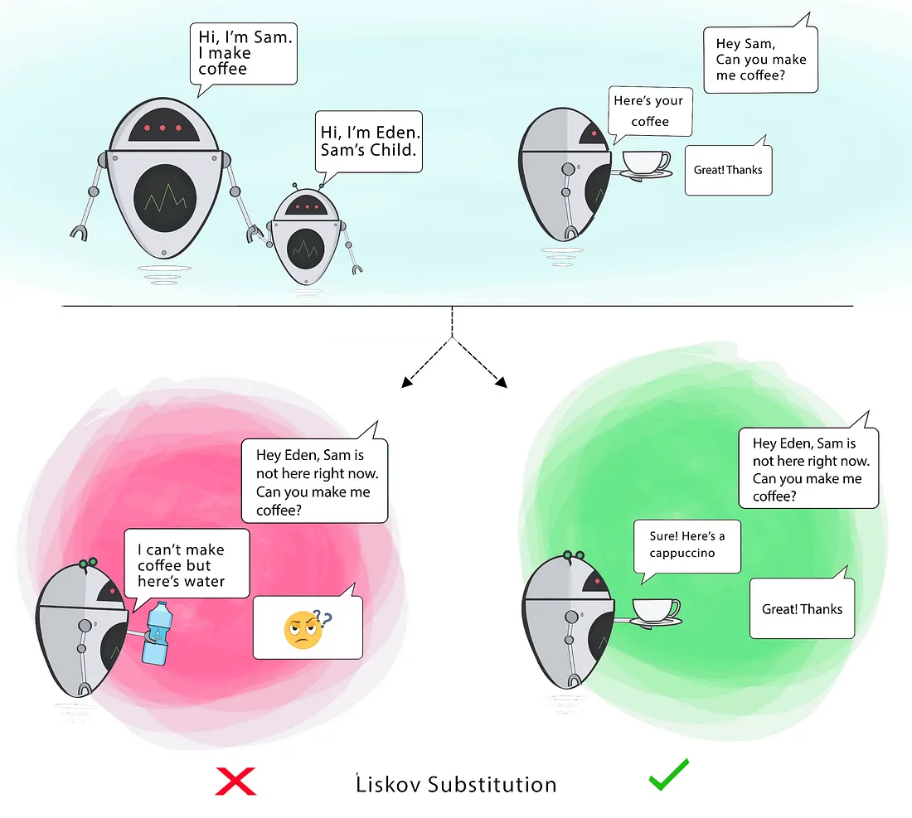

# Liskov Substitution Principle

Objects of a superclass should be replaceable with objects of its subclasses without altering the correctness of the program.

**Goal:** This principle aims to enforce consistency so that the parent Class or its child Class can be used in the same way without any errors.

This means that a subclass should fully support the behavior of its parent class without introducing unexpected behavior or limitations. If a subclass cannot fulfill the contract of its parent class, it violates the LSP.



**Without LSP:**
```c++
#include <iostream>
#include <string>

// Base class
class Bird {
public:
    virtual void fly() {
        std::cout << "This bird can fly.\n";
    }
};

// Subclass 1: A bird that can fly
class Sparrow : public Bird {
public:
    void fly() override {
        std::cout << "Sparrow flying.\n";
    }
};

// Subclass 2: A bird that cannot fly
class Penguin : public Bird {
public:
    void fly() override {
        // Penguins can't fly, but we are forced to implement this.
        throw std::logic_error("Penguins cannot fly!");
    }
};

void letBirdFly(Bird& bird) {
    bird.fly(); // Expect all birds to fly
}

int main() {
    Sparrow sparrow;
    letBirdFly(sparrow); // Works as expected

    Penguin penguin;
    try {
        letBirdFly(penguin); // Throws an error
    } catch (const std::logic_error& e) {
        std::cerr << "Error: " << e.what() << "\n";
    }

    return 0;
}
```

**Issues:**
1. The `Penguin` class violates LSP because it cannot fully substitute for the `Bird` class.
2. Code that expects any `Bird` to fly will fail when using `Penguin`.
3. This design introduces runtime errors, making the system fragile.

**With LSP:**
```c++
#include <iostream>
#include <string>

// Base class
class Bird {
public:
    virtual void eat() {
        std::cout << "This bird is eating.\n";
    }
};

// Separate interface for flying birds
class FlyingBird : public Bird {
public:
    virtual void fly() = 0; // Only birds that can fly implement this
};

// Subclass 1: A bird that can fly
class Sparrow : public FlyingBird {
public:
    void fly() override {
        std::cout << "Sparrow flying.\n";
    }
};

// Subclass 2: A bird that cannot fly
class Penguin : public Bird {
public:
    void swim() {
        std::cout << "Penguin swimming.\n";
    }
};

void letBirdFly(FlyingBird& bird) {
    bird.fly(); // Works only for flying birds
}

int main() {
    Sparrow sparrow;
    letBirdFly(sparrow); // Works as expected

    Penguin penguin;
    penguin.swim(); // Works as expected without violating LSP

    return 0;
}
```

**Benefits of This Approach:**
1. Correct Substitution:
   1. `Sparrow` can substitute `FlyingBird` without issues.
   2. `Penguin` does not inherit `FlyingBird`, avoiding inappropriate behavior.
2. Clear Separation of Behavior:
   1. The `Bird` class represents common behaviors (e.g., `eat`).
   2. The `FlyingBird` class represents flying behavior, which only applicable subclasses inherit.
3. No Runtime Errors:
   1. The design eliminates runtime errors caused by incorrect assumptions about subclasses.