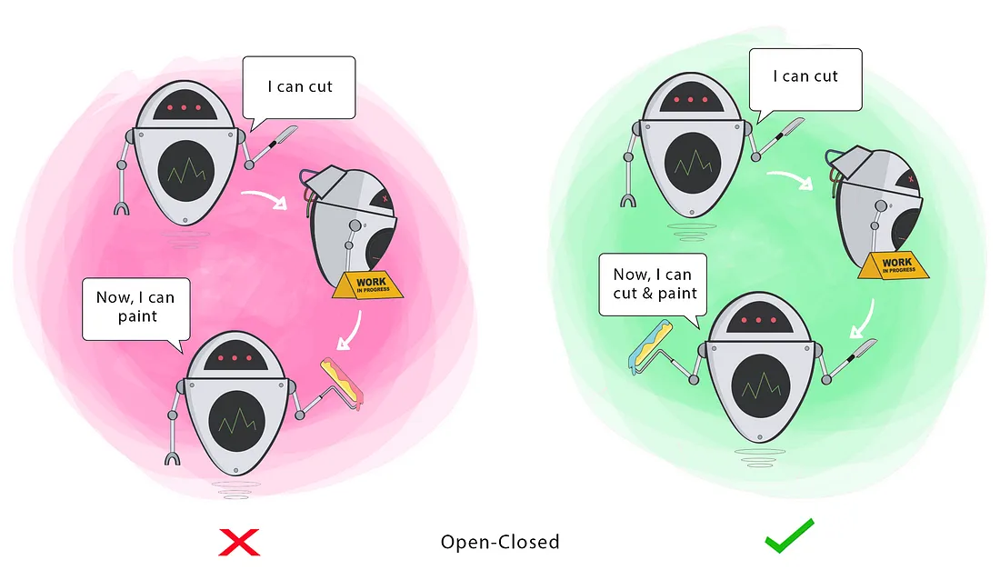

# Open/Closed Principle
- Open for extension but closed for modification
  
**Goal** - This principle aims to extend a Class’s behaviour without changing the existing behaviour of that Class. This is to avoid causing bugs wherever the Class is being used.

This means you should design your code in a way that allows you to add new functionality without altering existing code, reducing the risk of introducing bugs.



**Without OCP**
```c++
#include <iostream>
#include <string>

class DiscountCalculator {
public:
    double calculateDiscount(const std::string& userType, double amount) {
        if (userType == "Regular") {
            return amount * 0.05; // 5% discount
        } else if (userType == "Premium") {
            return amount * 0.10; // 10% discount
        } else if (userType == "VIP") {
            return amount * 0.20; // 20% discount
        } else {
            return 0.0; // No discount
        }
    }
};
```

**Issues:**
1. Adding a new user type requires modifying the `calculateDiscount` method.
2. Each modification increases the risk of breaking existing functionality.
3. The class violates OCP because it is not closed for modification.

**With OCP:**
```c++
#include <iostream>
#include <string>
#include <memory>
#include <vector>

// Abstract base class for discounts
class Discount {
public:
    virtual ~Discount() = default;
    virtual double calculate(double amount) const = 0;
};

// Concrete class for Regular user discount
class RegularDiscount : public Discount {
public:
    double calculate(double amount) const override {
        return amount * 0.05; // 5% discount
    }
};

// Concrete class for Premium user discount
class PremiumDiscount : public Discount {
public:
    double calculate(double amount) const override {
        return amount * 0.10; // 10% discount
    }
};

// Concrete class for VIP user discount
class VIPDiscount : public Discount {
public:
    double calculate(double amount) const override {
        return amount * 0.20; // 20% discount
    }
};

// Discount calculator
class DiscountCalculator {
private:
    std::unique_ptr<Discount> discountPolicy;

public:
    void setDiscountPolicy(std::unique_ptr<Discount> policy) {
        discountPolicy = std::move(policy);
    }

    double calculateDiscount(double amount) const {
        if (discountPolicy) {
            return discountPolicy->calculate(amount);
        }
        return 0.0; // Default no discount
    }
};
```

**Benefits:**
1. Extensibility: Adding a new discount type (e.g., "Student Discount") only requires creating a new class that extends `Discount`. No existing code needs to change.
2. Maintainability: The existing code remains untouched, reducing the risk of introducing bugs.