# UML Diagram

Unified Modeling Language (UML) is a standard way to visualize the design of a software system.

## Relationships in UML Class Diagrams

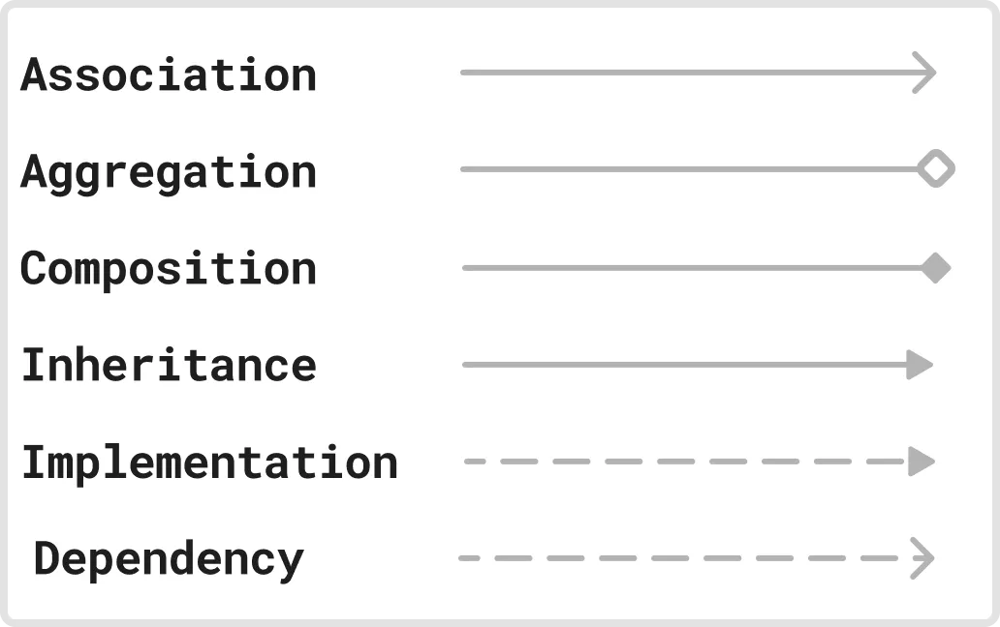

--- 

| Name       | Def                                | Diagram          |
|---------------|------------------------------------------|----------------|
| Association | Association represents a **"uses-a"** relationship between two classes where one class uses or interacts with the other. | 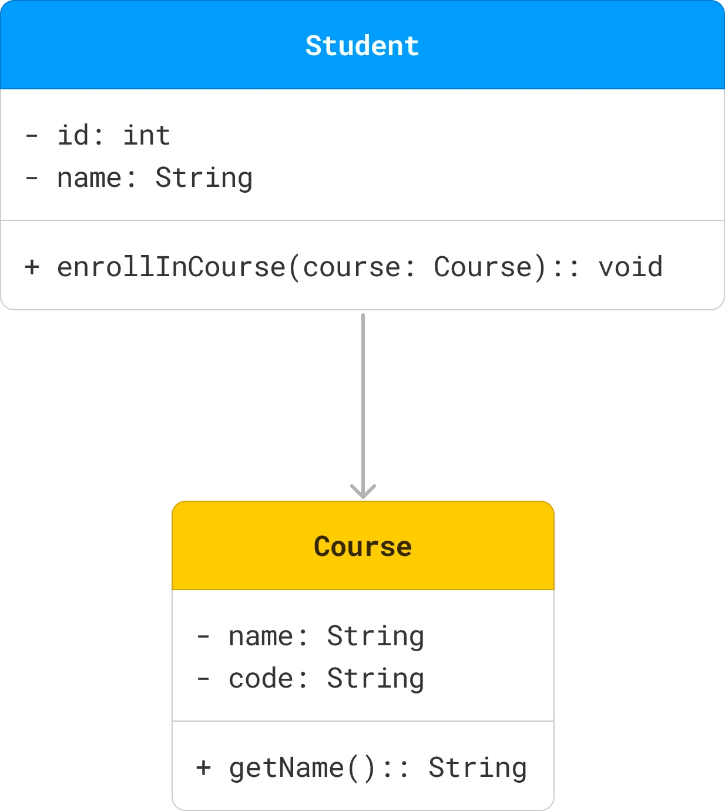 |
| Aggregation | Aggregation represents a **"has-a"** relationship where one class (the whole) contains another class (the part), but the contained class can exist independently. | 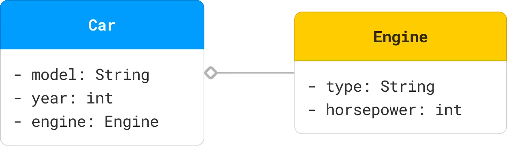 |
| Composition | Composition represents a **strong "has-a"** relationship where the part cannot exist without the whole. If the whole is destroyed, the parts are also destroyed. | 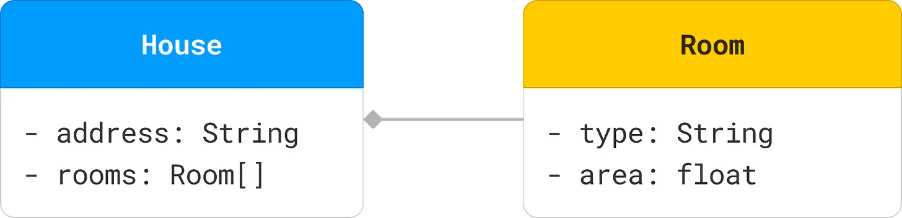 |
| Inheritance | Inheritance (or Generalization) represents an **"is-a"** relationship where one class (subclass) inherits the attributes and methods of another class (superclass). | 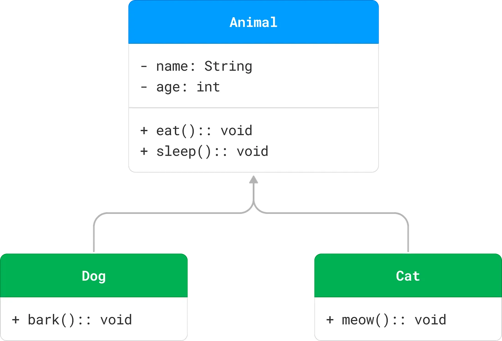 |
| Realization (Implementation) | Realization or implementation represents a relationship between a class and an interface, where the class implements the methods declared in the interface. | 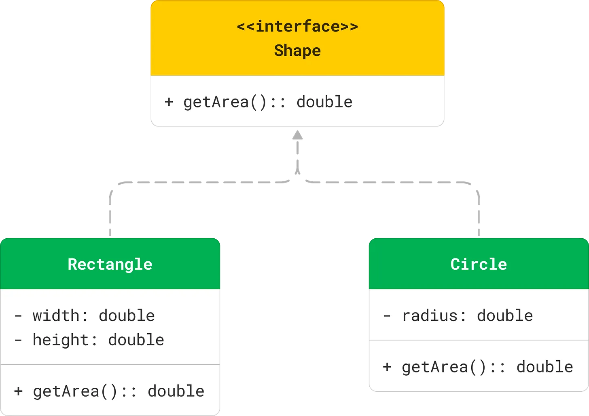 |
| Dependency | Dependency represents a **"uses"** relationship where a change in one class (the supplier) may affect the other class (the client). | 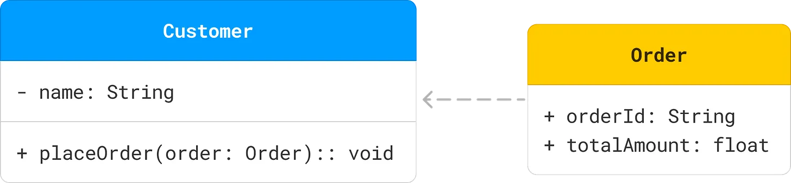 |

---
**Combined Example:**

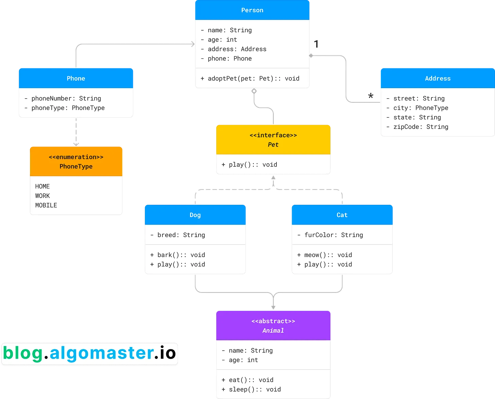

The relationships between the classes are as follows:
- **Inheritance**: Dog and Cat inherit from Animal.
- **Realization/Implementation**: Dog and Cat implement the Pet interface. 
- **Aggregation**: Person has an aggregation relationship with Pet, indicating that a person can have multiple pets. 
- **Composition**: Person has a composition relationship with Address, indicating that an address cannot exist without a person. 
- **Association**: Person has an association relationship with Phone, indicating that a person can have multiple phone numbers.
- **Dependency**: Phone depends on the PhoneType enumeration for the phoneType attribute.

---

## Building Blocks of UML Class Diagrams

| Name          | Properties                                    | Diagram          |
|---------------|------------------------------------------|----------------|
| Class         | A class is a blueprint or template that defines the properties and behavior of an object. | 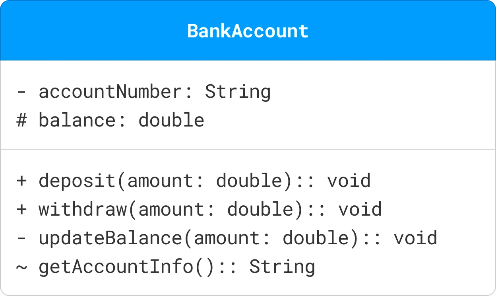          |
| Attributes    | Attributes in a UML class diagram represent the properties or data fields of a class. | 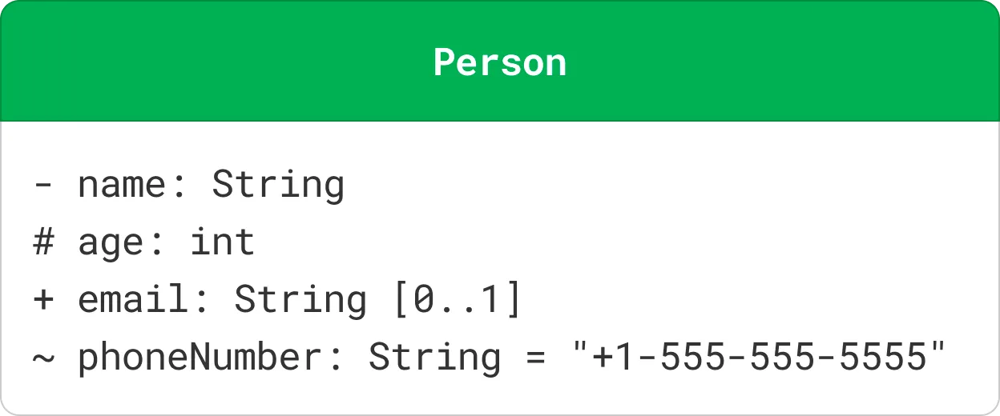          |
| Methods    | Methods (or operations) in a UML class diagram represent the functions or behaviors that a class can perform | 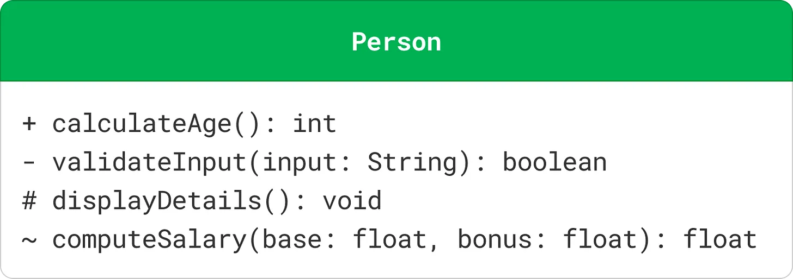          |
| Interfaces    | <ul><li>An interface defines a contract for classes that implement it. It specifies a set of methods that the implementing classes must provide.</li><li>Interfaces are depicted as a class rectangle with the keyword «interface» above the interface name. Methods in interfaces are abstract by nature, so they are usually shown without any implementation details.</li></ul>  | 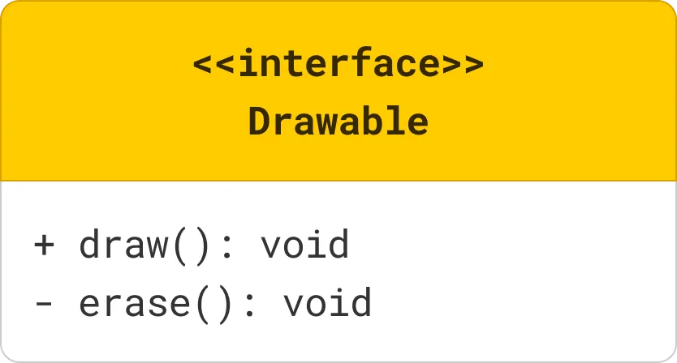           |
| Abstract Class    | <ul><li> An abstract class is a class that cannot be instantiated (you can't create objects directly from it).</li><li> It serves as a blueprint for other classes (subclasses) that inherit from it.</li><li>An abstract class in UML is represented with the class name in italics and the keyword «abstract» above the class name. Abstract methods within the class are also typically shown in italics.</li></ul> | 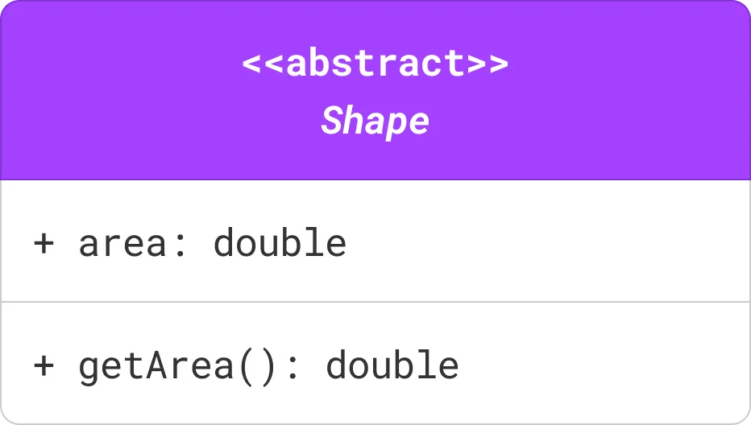           |
| Enumeration    | <ul><li>An enumeration is a data type that defines a set of named values (e.g., colors, days of the week). Enumerations, or enums, are represented with the keyword «enumeration» above the enumeration name.</li><li>The values of the enumeration are listed within the class box.</li></ul>  | 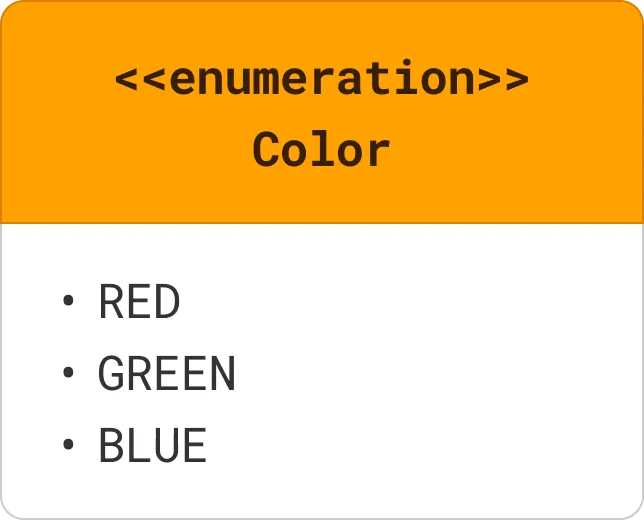           |
| Multiplicity    | <ul><li>Multiplicity specifies the number of instances of one class that can be related to a single instance of another class.</li><li>It is represented by a number or a range of numbers near the end of an association line.</li><li> Common multiplicities include: 1 (exactly one), 0..1 (zero or one), * (zero or more), 1..* (one or more).</li></ul> | -           |

**Visibility Markers:** It indicate the accessibility of attributes and methods within a class.
- `+ (Public)`: The attribute or method is accessible from any class.
- `- (Private)`: The attribute or method is only accessible within the same class.
- `# (Protected)`: The attribute or method is accessible within the same class and its subclasses.
- `~ (Package)`: The attribute or method is accessible within the same package.

